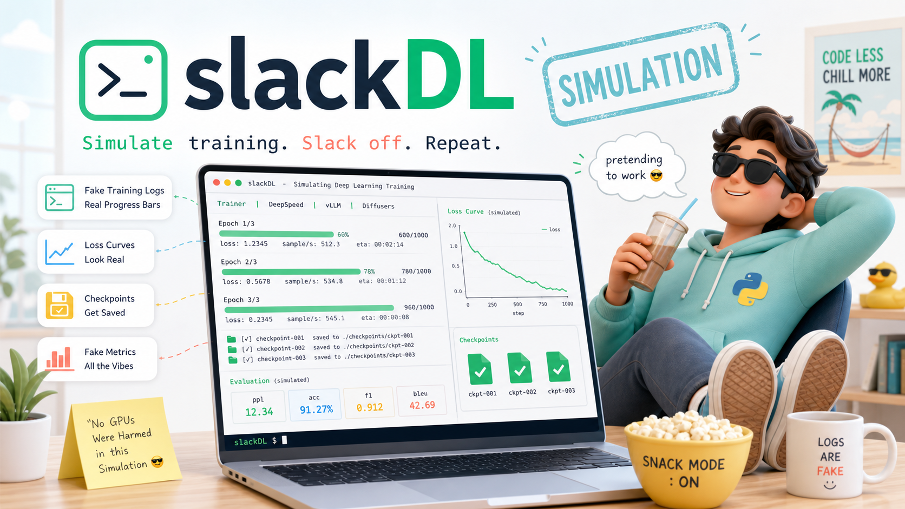

# slackDL

[English README](README.md)



`slackDL` 是一个 preset-first 的终端深度学习运行模拟器。它不会真正训练模型，但会像一场真实训练任务一样，在终端里经历环境扫描、warmup、主训练循环、事故窗口、恢复、eval、checkpoint 和 summary。它适合演示、日志解析测试、教学，也适合在需要让终端看起来非常认真时，给屏幕一点可信的训练现场感。

v1 风格重设计后，`slackDL` 不再主打几十个散落参数，而是提供内置 preset 和 YAML 剧本：你选择一个运行场景，它负责把日志节奏、指标变化、事件和收尾报告串成一场完整的终端训练大片。

## 特性

- 内置多种可信训练/服务场景：LLM 预训练、Diffusers LoRA、vLLM 上线彩排、BERT 微调和短平快演示。
- 支持 YAML 剧本，自定义阶段、日志风格、事件、checkpoint 频率和随机种子。
- 输出 Hugging Face `Trainer`、DeepSpeed、vLLM、Stable Diffusion/Diffusers 风格日志。
- 支持可复现 seed、彩色日志字段、快速零延迟演示和最终 summary 表格。
- 默认不会执行真实训练，也不会下载模型或占用 GPU。

## 安装

需要 Python 3.8 或更高版本。

```bash
python3 -m pip install .
```

开发模式安装：

```bash
python3 -m pip install -e .
```

## 快速开始

查看内置 preset：

```bash
slackDL presets
```

运行一个大模型预训练现场：

```bash
slackDL run llama-70b-pretrain
```

快速演示，不等待真实延迟：

```bash
slackDL run boss-is-watching --step-delay 0
```

使用 YAML 剧本：

```bash
slackDL run --config tests/fixtures/sample_run.yaml
```

直接运行 `slackDL` 会显示推荐命令，不会自动启动一场很长的训练。

## 内置 Preset

| Preset | 适合场景 |
| --- | --- |
| `llama-70b-pretrain` | DeepSpeed 风格的大模型预训练，包含 warmup、loss scale、NCCL/allreduce 氛围和 sharded checkpoint。 |
| `sdxl-lora` | Stable Diffusion/Diffusers 风格的 LoRA 训练，包含 EMA、diffusion timestep、latent cache 和 sample preview 味道。 |
| `vllm-launch` | vLLM serving 风格的上线彩排，突出请求队列、KV cache、TTFT、TPOT 和吞吐恢复。 |
| `bert-finetune` | 经典监督微调，突出 eval metrics、accuracy/F1 和轻微 overfit warning。 |
| `boss-is-watching` | 短平快但足够可信的“终端正在认真训练”场景。 |
| `deadline-finetune` | deadline 前的 adapter 微调现场，玩梗克制，日志仍保持真实感。 |

## 命令

```bash
slackDL presets
slackDL run <preset>
slackDL run --config path/to/run.yaml
```

`run` 支持少量覆盖参数：

| 参数 | 说明 |
| --- | --- |
| `--steps` | 覆盖总模拟 step 数。 |
| `--step-delay` | 覆盖每 step 的基础等待时间，演示时可设为 `0`。 |
| `--seed` | 覆盖随机种子。 |
| `--log-every` | 覆盖指标日志频率。 |
| `--save-every` | 覆盖 checkpoint 频率，`0` 表示禁用。 |
| `--rainbow` | 为日志字段启用 ANSI 彩色输出。 |

旧版顶层参数如 `--scenario`、`--log-style`、`--steps` 不再是主入口。直接使用旧参数时，CLI 会给出迁移提示，推荐改用 `slackDL run <preset>` 或 `slackDL run --config ...`。

## YAML 剧本

YAML 剧本可以定义一次自定义训练现场：

```yaml
name: office-demo
description: A compact cinematic run for a terminal demo.
log_style: deepspeed
seed: 42
steps: 120
step_delay: 0.02
log_every: 6
save_every: 30
project_name: demo
run_name: office-demo-rank0
stages:
  - name: bootstrap
    start_pct: 0.0
    end_pct: 0.1
    scenario: llm-pretrain
    chaos_level: 0
  - name: train
    start_pct: 0.1
    end_pct: 0.75
    scenario: llm-pretrain
    chaos_level: 1
  - name: incident
    start_pct: 0.75
    end_pct: 0.9
    scenario: llm-pretrain
    chaos_level: 2
    events:
      - level: WARNING
        message: "NCCL watchdog noticed a slow allreduce; rank0 keeps the job alive"
        at_pct: 0.8
  - name: summary
    start_pct: 0.9
    end_pct: 1.0
    scenario: llm-pretrain
    chaos_level: 0
```

支持的顶层字段包括：`name`、`description`、`log_style`、`seed`、`steps`、`step_delay`、`speed_jitter`、`log_every`、`save_every`、`save_delay`、`project_name`、`run_name`、`loss_start`、`loss_min`、`acc_start`、`oscillation`、`stages`。

`stages` 支持 `name`、`start_pct`、`end_pct`、`scenario`、`chaos_level`、`events`。事件支持 `level`、`message` 和 `at_pct`。

## 日志风格

- `trainer`：Hugging Face `Trainer` 风格指标字典。
- `deepspeed`：DeepSpeed wall-clock/profiler 风格日志。
- `vllm`：vLLM serving metrics 风格日志。
- `stable-diffusion`：Diffusers/Accelerate 风格 step 日志。

## 训练阶段

一次 cinematic run 可以包含这些阶段：

- `bootstrap`：启动、环境扫描、seed 和项目路径信息。
- `warmup`：学习率 warmup、吞吐爬升。
- `train`：主训练循环。
- `incident`：OOM、overflow、NCCL、wandb retry、loss spike 等事故窗口。
- `recovery`：scaler、checkpoint、吞吐和队列恢复。
- `eval`：验证集指标和 best checkpoint 判断。
- `checkpoint`：checkpoint 合并或保存。
- `summary`：运行结束表格，展示最终 loss、事故次数、恢复次数和 checkpoint。

## 开发

运行测试：

```bash
python3 -m unittest discover -s tests
```

CLI smoke test：

```bash
python3 -m simulate_train.main presets
python3 -m simulate_train.main run boss-is-watching --step-delay 0 --steps 5 --save-every 0
```

## 许可证

MIT
