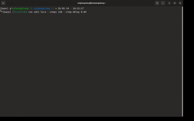

# TrainFake

[English README](README.md) | [文档索引](docs/README.md)


> 可信 AI 训练日志生成器：给演示、教学、测试和认真摸鱼一个完整终端现场。

`TrainFake` 是一个 preset-first 的终端 AI 训练运行模拟器。它不会真正训练模型、下载权重或占用 GPU，只负责模拟一场可信的终端训练现场：环境扫描、warmup、主训练循环、事故窗口、恢复、eval 风格指标、checkpoint 和 summary。

## 快速开始

需要 Python 3.8 或更高版本。

```bash
python3 -m pip install .
trainfake presets
trainfake run boss-is-watching --step-delay 0
trainfake tui boss-is-watching
```

运行自定义 YAML 剧本：

```bash
trainfake run --config tests/fixtures/sample_run.yaml
```

## 功能概览

- 内置 LLM 预训练、Diffusers LoRA、vLLM 上线彩排、BERT 微调、RLHF 奖励模型、RAG 评测、多模态预训练和 GPU 集群演练等场景。
- 使用 `trainfake run` 输出传统流式日志。
- 使用 `trainfake tui` 打开左右分屏 Textual 终端仪表盘。
- 支持 YAML 剧本，自定义阶段、事件、日志风格、checkpoint 频率和随机种子。

## 文档

- [使用指南](docs/usage_zh.md)
- [TUI 模式](docs/tui_zh.md)
- [YAML 剧本](docs/yaml-runs_zh.md)
- [开发说明](docs/development_zh.md)

## Demo 展示



## 许可证

MIT
